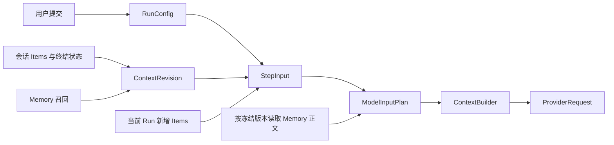

# 模型输入与 Memory：当前设计

更新日期：2026-09-07。本文描述长任务第一阶段已经实现的输入与记忆链路。
后续功能和实施顺序见 [LONG_TASK_PLAN.md](LONG_TASK_PLAN.md)。

## 1. 功能范围

当前 Runtime 提供：

- 提交时冻结模型、工作区、工具、身份、技能目录、上下文窗口及输出预留。
- 按模型窗口选择可用历史，保留成组的工具调用与结果。
- 在后续普通对话中提供失败、取消任务的执行事实和未知结果说明。
- 自动召回相关 Memory，冻结记录版本，再独立读取正文构造模型输入。
- 为每次模型调用保存明确的输入范围和预算，支持 Journal 重建与核查。

当前尚未实现语义压缩、运行中补充指令、任务完成检查、自动 Memory 提取或写入。
达到输入预算上限时仍会结束当前 Run；自动压缩属于下一阶段。

## 2. 一条输入链路



`RunConfig`、`ContextRevision` 和 `StepInput` 分别负责提交配置、上下文选择、
本次调用的输入范围。每类只有一种当前格式，不再保存重复的 Run Manifest。

| 记录 | 创建时间 | 保存内容 |
| --- | --- | --- |
| `RunConfig` | 用户提交、Run 入队时 | 会话及用户 Item 标识、工作区、模型与公开配置指纹、工具定义、身份与技能目录、模型窗口和输出预留 |
| `ContextRevision` | 首次准备模型调用时 | revision 序号、选中历史 Item/Turn 引用、Memory 引用及遗漏、历史终结说明、初始预算、Memory 包装字符元数据 |
| `StepInput` | 每次模型调用前 | 使用的 revision 序号、这次输入的完整 Item 引用范围、Memory 与状态元数据、当前预算 |
| `ModelInputPlan` | 发送请求前 | 临时组装的指令、上下文数据、消息、工具及输出上限 |

第一阶段每个 Run 创建初始 revision 1，后续 Step 引用它并追加本 Run 已结算的 Items。
下一阶段的压缩会追加新 revision；当前不会生成摘要，也不会修改已有 revision。

## 3. 提交配置与模型容量

`RunConfigTemplate` 只用于尚未分配会话、Turn、Run、Item 标识的提交准备阶段。
真正的执行真源是持久化的 `RunConfig`。

模型容量初始值：

| 配置 | 默认值 | 用途 |
| --- | --- | --- |
| `contextWindow` | 32,768 tokens | 模型能够接收的总上下文容量 |
| `maxOutputTokens` | 4,096 tokens | 输出预留；作为 `max_tokens` 发送给 OpenAI Compatible Provider |

模型窗口和输出预留可以在模型设置中修改；Run 提交后使用冻结值。
输出预留必须大于零且小于模型窗口。RunConfig 不含总调用次数或总运行时长上限，
界面仅展示累计调用次数与耗时，用户可以手动停止任务。
Provider Adapter 每次调用只发送一次请求，不在内部隐式重试。单次请求的连接、
响应头和流空闲超时，以及取消后的有界资源清理继续保留。

工具定义、身份和技能目录也在提交时冻结。开始执行时核对实际环境；不符合冻结配置
就明确失败。身份、工具和运行策略不会被 Memory、历史摘要或工具输出重新定义。
凭据不进入上述输入记录，公开 Provider 配置使用不含凭据的指纹核对。

## 4. 输入预算

可用于输入的容量为：

```text
maximumInput = contextWindow - maxOutputTokens
currentRunReserve = floor(maximumInput / 4)，至少为 1
```

首次选择历史时保留 `currentRunReserve`，为后续工具执行结果留空间。
后续 Step 可以消耗这部分预留，但全部实际输入估算必须小于等于 `maximumInput`。
原来的 48,000 / 12,000 字符常量已经删除。

当前使用 `conservative-utf8-upper-bound` 计量：它是保守估算，不是模型 tokenizer
给出的精确 token 数。文本以 UTF-8 字节数估算，并为消息和请求结构预留开销。
工具定义、工具参数、结果和推理内容按其进入模型请求的形式计量。

预算分别记录以下部分，最后求和：

- Runtime 指令。
- 工具定义。
- 历史消息、调用和结果。
- 当前 Run 消息、调用和结果。
- Memory 正文。
- Memory 包装和历史终结说明等上下文数据。

Memory 引用只有字符元数据，因此正文及包装采用每字符最多 4 字节的保守估算。
实际 Memory 字符数和包装字符数另行保存；读取正文时依据这些元数据校验，不能从
预算数值反推正文或重新构造记忆。

### Memory 如何适应不同窗口

召回先按相关性排序，最多选取 8 条、6,000 字符。随后根据当前 Run 的模型窗口、
输出预留、当前用户输入、身份和工具定义，再限制 Memory 可用空间：

```text
remaining = maximumInput - currentRunReserve - instructions - tools - currentUserInput
memoryAllowance = max(0, min(remaining / 2, remaining - 4096))
```

Memory 最多使用剩余空间的一半，并保留至少 4,096 个估算 tokens 给会话历史和失败
说明；小窗口下可以完全省略 Memory。候选记录按相关性逐条尝试，保留完整记录，
不截断正文；放不下的记录保存为 `omitted_by_budget`。

因此，积累较多 Memory 不会单独使一个原本能执行的简单新请求无法开始。
用户输入、指令本身或必要状态说明超出模型窗口时，仍会明确报告输入预算不足。

## 5. 会话历史与失败继续

历史按 Turn 从近到远读取，选择连续的最近后缀。首个放不下的 Turn 成为遗漏边界，
不会绕过它去选择更早的零散消息。历史工具调用和结果必须完整成组。

已完成、失败或取消任务中持久化的工具结果，都可以成为下一轮输入。尚未完成的
助手文本不会被当作完整回答。每个相关失败 Run 另外带有终结说明，包括失败原因、
操作可能已生效，以及结果不明确时需要先核查当前状态。

最近失败任务无法完整纳入时，保留简短的“执行细节缺失，先核查”说明。该说明与
Memory 分别计量，且不会写入 Memory。

用户输入“继续”、补充要求或提出无关新问题，都使用同一套历史规则；没有关键词
触发的特殊恢复模式。旧调用只作为上下文数据，不重新调度。模型需要新的操作时，
必须产生新的工具调用。

## 6. Memory 的职责和边界

Memory 是用户明确维护的长期信息，使用独立的 `memory.db`：

- 支持全局和工作区范围。
- 支持创建、纠正、忘记、列表和详情，以及来源信息和 revision。
- 每个 Run 自动按关键词相关性召回一次。
- 每个 Step 按冻结的 ID/revision 读取正文；Run 中发生的纠正只影响以后新 Run。
- 遗忘或版本不可用时，按照明确的 Memory 错误结束，不能静默替换正文。
- 读取、选取和物化 Memory 时，不持有 Session 数据库写事务。

正文以带来源信息的 JSON 包装为 `contextual_data`，不能改变工具权限、Runtime
身份、执行策略或当前用户请求。Memory 不保存运行中进度、失败恢复说明、命令日志
或文件差异。当前没有模型可调用的 Memory 写入工具，也没有自动经验提取流程。

## 7. 文件与进程记录

文件预览和修改差异独立于模型输入。预览读取、差异正文和 `file.change_recorded`
事件不会因持久化或重连自动进入 Provider 请求。

托管命令采用 `process_start/read/wait/stop`。启动成功仅表示进程已启动；实际退出
状态和输出通过后续查询获得。`process.recorded` 保存运行观察，用于重建和界面状态；
只有模型调用工具取得的结果才进入会话历史。

进程归属由 Runtime 提供的 `(Run, Step, Tool Call Item, Thread)` 执行上下文确定。
Run 结束时清理其进程。Runtime 重启会把尚未完成的进程记录标为未知，不按 PID 接管，
不重放启动命令；普通新一轮对话依据已记录的事实继续。

## 8. 持久化与开发数据政策

Session 使用当前 schema 11；Journal 只接受 schema 8，客户端协议为 5。
主要投影为 `run_configs`、`context_revisions` 和 `model_calls`。
首次 `model.input_prepared` 事件携带完整 ContextRevision，后续事件以 `null`
表示不重复发送正文，使用 StepInput 中的序号引用已有 revision。

Journal 保留执行事实，投影可以重建。重建时验证输入范围、预算、作用域和调用序号，
不会执行工具或重新调用 Provider。

项目目前没有外部用户，使用单一当前协议及数据结构。旧解析器、选择器注册、双读、
旧队列执行和迁移链已经删除；不为旧开发数据增加兼容分支。旧 Session 数据库需要
通过显式开发重置流程处理，不能把无法解析的数据解释为当前格式。Session 重置与
独立 Memory 数据维护是不同操作。

## 9. 验证重点

- 模型窗口和输出预留冻结；非法配置在执行前拒绝。
- 无任务总调用次数或时长上限；调用计数、手动取消、单次请求超时及有界清理可核查。
- 实际 Provider 请求保留失败执行事实，且旧工具不会自动重放。
- 历史调用与结果成组；超预算失败任务保留必要状态说明。
- 6,000 字符 Memory 在默认窗口下按完整记录裁减，新请求仍可执行。
- Memory 纠正、遗忘、来源、精确 revision 和事务边界。
- Journal 重建输入不变；错误预算、跨作用域引用和旧格式被拒绝。
- Python 与 Desktop 使用同一 Golden Trace 校验当前协议。
