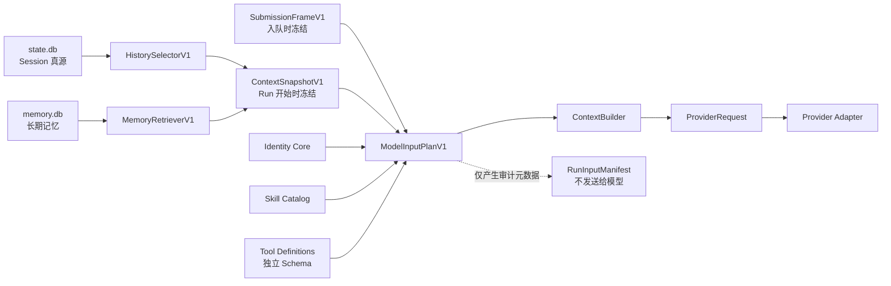

# 模型输入与记忆基础设计

状态：**IN PROGRESS（Gate 0–1 已完成，Gate 2–10 尚未实现）**

审阅基线：`8e09f5c`（2026-08-16）。该提交只用于说明本文编写时核对的代码快照，
不是永久的“当前版本”声明。已经落地的 Runtime 总体架构以
[DESIGN.md](DESIGN.md) 为准；真实 DeepSeek 验证记录以
[LIVE_VALIDATION.md](LIVE_VALIDATION.md) 为准。

本文定义 Ikaros 下一阶段“模型输入与记忆基础”的架构、边界和严格串行 Gate，
并记录各 Gate 的实施状态。只有下文明确标为 `CURRENT` 或表中标为“已完成”的
能力才已存在；Identity Core、History Selector 和长期 Memory 仍未实现。

## 1. 阅读规则

本文使用以下状态：

| 标记 | 含义 |
| --- | --- |
| `CURRENT` | 已在审阅基线中实现，并由代码或测试支撑 |
| `PROPOSED` | 本阶段计划实现，当前不能作为产品能力宣传 |
| `DEFERRED` | 明确不在本阶段实现 |

实施约束：

1. Gate 0 到 Gate 10 严格串行。
2. 一个 Gate 必须形成真实可运行链路并通过自己的门禁，才能进入下一个。
3. 每个 Gate 形成一个原子 commit；不并行铺模块，不提交空实现、`TODO` 或提前
   开发后续能力。
4. 预发布期继续采用 reset-only 策略，不增加 Migration、Upcaster、双读或兼容
   回退。
5. 未获得单独授权不得 push，也不得改写 Git 历史。

## 2. 目标和非目标

目标不是立即让 Ikaros“自动记住一切”，而是先建立一条有边界、可复现、
可审计的输入链路：



阶段完成时，Ikaros 应具备：

- 稳定、极小且可版本化的身份核心；
- 有硬上界、不会拆散 Tool Call/Result 的会话上下文；
- 用户可明确创建、纠正、忘记和管理的长期 Memory；
- 有限、确定性、可审计的 Memory 召回；
- Provider 可替换而 Ikaros 身份不随模型切换；
- Memory 和 Prompt 内容不能改变 Runtime 的真实 Tool Policy；
- Session reset 不会删除长期 Memory。

本阶段明确不做：

- 自动 Memory 提取；
- Embedding 或向量数据库；
- 自动合并、衰减或摘要 Memory；
- History Compaction；
- 人格演化、情感状态机或关系数值系统；
- Subagents 或后台自治任务；
- Provider-facing Memory Write Tool；
- 复杂审批系统；
- 多 Provider 原生 Prompt 矩阵。

## 3. 审阅基线

### 3.1 `CURRENT`

审阅基线已经具备：

- `Thread -> Branch -> Turn -> Run -> Item` 的 SQLite Journal 与可重建投影；
- SQLite schema 5、Journal Event schema 2、Protocol version 1；
- 21 个初始化后 RPC 和 10 种持久 Journal Event；
- 独立的
  [ContextBuilder](src/ikaros_runtime/agent/context.py)，负责把固定输出样式、
  额外 system fragment、完整 Branch 历史和 Tool definitions 渲染成
  `ProviderRequest`；
- Provider-neutral 的
  [ProviderRequest](src/ikaros_runtime/providers/base.py)，以及
  [OpenAI-compatible Adapter](src/ikaros_runtime/providers/openai_compatible/adapter.py)；
- `process_run`、`read`、`write`、`edit` 四个内置 Tool；
- Skills V0：安全扫描 `~/.ikaros/skills/<name>/SKILL.md`，提供目录诊断和全局
  enable/disable，在 `turn.start` 时冻结启用的 name/description/location
  descriptors，并在模型 Step 中发送这份目录；
- Skill 正文不会自动注入。模型需要通过普通 `read` Tool 按需读取
  `SKILL.md`；脚本仍通过普通 `process_run` 执行，没有独立 Skill executor；
- ScriptedProvider 和真实 DeepSeek 的多轮、文件 Tool、Skill descriptor
  冻结和 Token usage 纵切验证。

### 3.2 `PROPOSED`

审阅基线尚未实现：

- `ModelInputPlanV1`；
- `SubmissionFrameV1`、`ContextSnapshotV1` 或统一 TaskFrame；
- `RunInputManifest`；
- 历史预算和分页 History Selector；
- Identity Core；
- `memory.db`、Memory RPC、Memory UI 或 Memory 召回；
- 任务级 Skill 选择和 Skill Catalog 总预算；
- Provider 实际返回 model/request ID 的持久化。

当前
[context_items](src/ikaros_runtime/storage/projections.py)
仍会读取当前 Branch 截至本 Turn 的全部合格历史，并在每个 Tool Step 重新装配。
因此已实现的 `ModelInputPlanner` 目前仍保留无界历史行为；`ContextBuilder` 只是
确定性渲染器，不负责选择历史或 Memory。

### 3.3 Gate 1 实施增量

Gate 1 在审阅基线之后增加了：

- Provider-neutral、结构不可变的 `ModelInputPlanV1`；
- 带 `authority`、`scope`、`lifetime` 和来源的 Output Style、Skill Catalog
  Instruction Blocks；
- 明确为空的 Context Data、Provider-default generation options 和
  legacy-unbounded budget snapshot；
- Gate 1 的 ContextBuilder 明确拒绝非空 Context Data，避免在 Gate 9 定义安全包装
  前将普通数据提升成无包装的 System Instruction；
- `AgentLoop -> ModelInputPlanner -> ContextBuilder -> ProviderRequest` 生产链；
- 贯穿 SQLite、双 Tool Step、OpenAI-compatible Adapter 和最终 HTTP Body 的静态
  Golden Test。

这仍不包括持久 Frame、Manifest、Identity、Memory 或历史预算。

## 4. 概念边界

| 概念 | 负责什么 | 不负责什么 |
| --- | --- | --- |
| Session History | 记录一个 Thread 中实际发生过什么 | 决定跨 Thread 应长期保留什么 |
| Memory | 保存跨 Thread 仍需保留的事实、偏好、关系和项目经验 | 代替完整会话历史或 System Instructions |
| Identity Core | Ikaros 最小、稳定、版本化的身份原则 | 用户偏好、项目事实或长期经历 |
| Submission Frame | 冻结用户提交进入队列时已经确定的 Run 契约 | 选择稍后才存在的历史或 Memory |
| Context Snapshot | Run 真正开始时冻结本次模型输入选择 | 修改用户原文或 Tool Policy |
| Model Input Plan | 表达一次 Provider 调用前的有序输入 | 执行 Provider-specific 协议 |
| History Compaction | 未来压缩旧 Session 历史 | 长期 Memory |
| Skills | 能力说明、资源和可按需读取的工作流 | Memory 或自动授权 |
| Tool Definitions | 模型可请求的结构化 Tool Schema | Prompt 正文 |
| Manifest | 审计模型看到了哪些来源和版本 | 发送给模型或复制敏感正文 |
| Provider Adapter | 将内部请求降级为具体 Provider 协议 | 决定身份、权限、History 或 Memory |
| Tool Policy | Runtime 强制执行的真实授权边界 | 依赖 Prompt 文字保证安全 |

当前产品没有单独的 `Session` 实体；一个产品会话对应一个 `Thread`。本文提到
“Session History”时，指 `Thread` 及其 Branch/Turn/Run/Item 历史，而不是新增
一个公共 Session API。

## 5. 跨 Gate 不变量

### 5.1 两阶段冻结

“入队后可恢复”和“Run 开始时才召回 Memory”不能混成一个快照。计划使用两层：

本文把原计划中的 `TaskFrame` 作为总称，并在持久契约中拆成
`SubmissionFrameV1 + ContextSnapshotV1`；它不是第三份重复记录。

```text
turn.start
  -> 持久化 User Item
  -> 持久化 SubmissionFrameV1
  -> Run queued

Scheduler 激活 Run
  -> HistorySelectorV1 选择历史
  -> MemoryRetrieverV1 选择 Memory（Gate 9 前为空）
  -> 持久化 ContextSnapshotV1
  -> 构造 ModelInputPlanV1
  -> 调用 Provider
```

`SubmissionFrameV1` 从 Gate 2 起一次性预留完整结构：

```text
SubmissionFrameV1
├─ schema_version
├─ user_item_id
├─ user_content_digest?          仅 state.db 内部完整性用途
├─ thread_id / branch_id / turn_id / run_id
├─ workspace snapshot
├─ provider_id / model_id
├─ public provider config fingerprint
├─ execution_policy
├─ enabled Skill descriptors
├─ complete Tool definitions and schemas
├─ instruction slots
│  ├─ output_style
│  ├─ identity_core?             Gate 4 前为空
│  └─ Skill catalog?
├─ context_data slots
│  └─ memory?                    Gate 9 前为空
└─ max_steps
```

API key、Headers、环境变量和完整 Provider transport 配置绝不进入 Frame、
Manifest 或 Journal。恢复时，如果当前配置缺失或其非敏感指纹不匹配，Run 明确
失败；不得静默换配置继续，也不得把凭据复制进 `state.db`。

`user_content_digest` 若实现，只能留在 `state.db` 用于完整性核对，不能进入
日志、UI 或公开 Manifest，也不能称为匿名化。用户正文仍以 User Item 为唯一真源。

`ContextSnapshotV1` 在 Run 由 queued 变为 running 后、第一次 Provider 调用前
冻结：

```text
ContextSnapshotV1
├─ selected history IDs and grouping
├─ selected Memory ID/revision/digest   Gate 9 前为空
├─ budget accounting
├─ omission reasons
└─ selection version
```

同一个 Run 的后续 Tool Step 继续使用同一历史与 Memory 选择，只追加本 Run
新产生的 Tool/Assistant Items，不重新召回或偷偷更换旧历史。

### 5.2 Authority、scope 和 lifetime

`ModelInputPlanV1` 中每个输入块至少带：

```text
id
version
source
authority
scope
lifetime
content
```

首个版本的 authority 至少区分：

- `runtime_identity`
- `runtime_instruction`
- `user_instruction`
- `contextual_data`

这些字段首先约束 Runtime 的装配、排序和审计。OpenAI Chat Completions 等协议
不能完整表达该语义，模型也不会自动执行 Ikaros 的 authority 类型。因此
ContextBuilder 必须使用固定包装和稳定顺序进行降级，但安全边界仍由
Tool Policy、参数校验和 ToolExecutor 强制执行，不能依靠 Prompt。

### 5.3 Manifest 隐私

Manifest 只记录可审计元数据：

- Plan、Frame、Selector 和 Instruction 版本；
- Item、Skill、Tool 和 Memory 的 ID/revision；
- 静态资源或 Tool schema 的 hash；
- 各部分字符数和总量；
- selected/omitted 结果及 omission reason；
- Provider/model 选择和安全的响应元数据。

Manifest 禁止保存：

- 完整用户或 Memory 正文；
- Tool Arguments 或 Tool Result；
- Reasoning Content；
- API Key、Headers、环境变量；
- 完整 HTTP 请求体；
- 可通过低熵文本轻易枚举的“脱敏 hash”。

V1 不截断单条 User/Assistant/Tool/Memory 内容，因此 Manifest 使用
`omissionReason`，而不是暗示已经发生内容截断。若未来增加截断，必须通过新的
版本和显式字段表达。

### 5.4 两个数据库的生命周期

| 文件 | 权威内容 | reset 规则 |
| --- | --- | --- |
| `config.yaml` | Provider/Model 配置、Skill disabled 名单 | Session reset 不得删除 |
| `skills/` | 用户安装的 Skill 目录和资源 | Session reset 不得删除 |
| `state.db` | Session Journal、投影、Run Frame/Manifest | 预发布期可在停机后显式 reset |
| `memory.db` | 长期 Memory 当前状态与 revision | Session reset 绝不触碰；需独立备份/授权 |
| `ui-preferences.json` | Desktop 主题、语言、布局、用户名 | Runtime reset 不得删除 |

`state.db` 和 `memory.db` 不使用 SQLite `ATTACH`、跨库外键或两阶段提交。
Memory 中的 Session provenance 是软引用。Session 被清空后，Memory 继续存在，
UI 只显示“来源记录不可用”。

一旦用户开始保存真实长期 Memory，Memory schema 就不能沿用“升级时随手清空”
的产品语义。预发布期如遇不兼容 schema，Runtime 必须明确报
`memory database schema is incompatible`，允许先做 raw backup/export，并且
只有用户明确授权才可 reset `memory.db` 及其 WAL/SHM。

## 6. 总体 Gate

| Gate | 内容 | 状态 | `state.db` 重置 |
| --- | --- | --- | --- |
| 0 | 修正文档和固定架构不变量 | 已完成 | 否 |
| 1 | `ModelInputPlanV1`，保持 Provider wire 不变 | 已完成 | 否 |
| 2 | Submission Frame、Context Snapshot、Manifest 与响应元数据 | 未开始 | 是，仅这一次 |
| 3 | `HistorySelectorV1`，限制无界历史 | 未开始 | 否 |
| 4 | `identity-core-v1` 与 DeepSeek A/B | 未开始 | 否 |
| 5 | 独立 `memory.db`，Create/List/Get | 未开始 | 不动 `state.db` |
| 6 | Correction、Forget、Provenance、幂等 | 未开始 | 否 |
| 7 | Memory Check、Backup、Export | 未开始 | 否 |
| 8 | Desktop Memory 管理页面 | 未开始 | 否 |
| 9 | Memory Read V1，有限召回并进入模型 | 未开始 | 否 |
| 10 | 全量测试、真实 DeepSeek、只读审计与文档收口 | 未开始 | 否 |

## 7. Gate 0：文档和架构边界

### 目标

- 修正 SQLite schema、Journal Event schema、RPC 数量和 Skills 状态等过时文档；
- 固化本文第 4、5 节的不变量；
- 将“已实现”“计划中”“明确不做”分开；
- 保证后续 Gate 不再依赖聊天记录理解架构。

### 验收

- [DESIGN.md](DESIGN.md)、[README.md](README.md)、Desktop README 与 Renderer
  DESIGN 和代码事实一致；
- 所有文档链接可解析；
- `git diff --check` 通过；
- 没有把 Memory、Identity、History Budget 或 Manifest 写成当前能力。

## 8. Gate 1：`ModelInputPlanV1`

状态：**CURRENT（已实现）**

### 目标

在 ContextBuilder 前增加 Provider-neutral 的模型输入计划，同时保证实际发送给
DeepSeek 的消息和 Tool schema 与当前版本相同。

建议新增：

```text
runtime/src/ikaros_runtime/agent/
├─ model_input.py
└─ context.py
```

核心结构：

```text
ModelInputPlanV1
├─ version
├─ instructions[]
├─ context_data[]
├─ messages[]
├─ tools[]
├─ generation_options
└─ budget_snapshot
```

Gate 1 只建立结构：

- 当前固定输出样式成为 `output-style-v1`；
- Skill Catalog 成为 Run 级 Instruction Block；
- `identity_core` 为空；
- `memory_context` 为空；
- ContextBuilder 在 Gate 9 定义版本化、安全的 Context Data 降级前拒绝非空
  `context_data`；
- Messages 和 Tools 保持独立；
- ContextBuilder 继续渲染为现有 `ProviderRequest`；
- Provider Adapter 的 wire 行为不变；
- Plan 自有的有序集合在运行时防御性转换为 tuple，保持结构不可变；既有
  `ContextItem.data`、Tool arguments 和 Tool schema 的递归快照属于 Gate 2。

执行链：

```text
ModelInputPlanner
  -> ModelInputPlanV1
  -> ContextBuilder
  -> ProviderRequest
  -> ProviderAdapter
```

### 验收

- 无 Identity、无 Memory 时，OpenAI-compatible 请求体与基线等价；
- System/User/Assistant/Tool 消息顺序不变；
- Tool Call 与 Tool Result 配对不变；
- Tool schema 不复制进 Prompt 正文；
- 增加贯穿 AgentLoop、Plan、ContextBuilder、Adapter 到最终 Body 的 Golden Test。

### 非目标

- 历史裁剪；
- 身份 Prompt；
- Memory Store；
- Token 估算；
- Prompt 模板语言；
- Provider-specific 特例。

## 9. Gate 2：Frame、Manifest 和响应元数据

这是本阶段唯一一次修改现有 Session 持久契约的 Gate。SQLite schema 从 5
变为 6，Journal Event schema 从 2 变为 3。按照 reset-only 政策，实施时停止
Runtime 并且只显式清理：

```text
~/.ikaros/state.db
~/.ikaros/state.db-wal
~/.ikaros/state.db-shm
```

绝不触碰 `config.yaml`、`skills/`、Desktop preferences 或未来的 `memory.db`。

### Submission Frame 和 Context Snapshot

实现第 5.1 节的两阶段冻结。Gate 2 必须预留 Identity 和 Memory 空槽，使 Gate 4
与 Gate 9 只填充既有契约，不再次改变 Session schema。

`turn.start` 当前会对正文执行 `.strip()`。应改为只用 `.strip()` 判断是否全是
空白，但原始用户内容必须原样保存。

Tool definitions 冻结完整名称、描述和参数 schema。恢复时 Tool schema 版本或
hash 不匹配，Run 以稳定错误失败，不能换成当前注册表继续执行。

### RunInputManifest

分为：

```text
Run Manifest
├─ plan/frame/selector versions
├─ instruction IDs and versions
├─ Skill descriptor IDs
├─ Tool schema IDs/hashes
├─ provider/model
└─ public provider config fingerprint

Step Manifest
├─ step ordinal
├─ selected history Item/Turn IDs
├─ selected Memory ID/revision       当前为空
├─ part character counts
├─ omission reasons
└─ total character count
```

### Provider Step 事件

一次准备完成的模型请求必须拥有统一终态，不能只有成功响应有 completion：

```text
model.input_prepared
model.response_finished
  outcome = completed | failed | cancelled
```

事件顺序是：

```text
run.state_changed(running)
  -> model.input_prepared(step=N)
  -> Provider stream
     -> item.started / item.delta / item.completed 可交错发生
  -> model.response_finished(step=N, outcome=...)
```

如果取消发生在 `model.input_prepared` 之前，不产生虚假的 response 终态。只要
某个 Step 已经 prepared，就必须最终拥有一个 `model.response_finished`。
如果进程在两者之间崩溃，启动恢复必须幂等补写
`outcome = failed, reason = runtime_interrupted`，再结算 Run，不能留下永久
悬空的 Provider Step。

`model.response_finished` 记录经过安全检查且有明确大小限制的：

- Provider 实际返回的 model（若提供）；
- request ID（若提供）；
- Provider-reported Token usage（若提供）；
- Step ordinal；
- outcome 和稳定错误类别。

Gate 2 必须选择单一 usage 真源。推荐由 `model.response_finished` 取代现有
`model.usage_recorded`，usage 投影从新事件重建，避免同一组 Token 被两个
Journal Event 重复记录。

### 验收

- queued Run 重启后仍使用原 Submission Frame；
- 每个 prepared Step 恰有一个 finished Event；
- 在 input-prepared/response-finished 之间注入进程中断，重启后只补偿一个
  `runtime_interrupted` 终态；
- Journal rebuild 恢复相同 Frame、Manifest 和 usage 投影；
- Frame、Manifest、Events、日志和 Desktop DTO 不含凭据或禁存正文；
- Provider config 或 Tool schema 漂移产生稳定、显式失败；
- 协议真源与生成 TypeScript 一致；
- reset 后只重新创建 `state.db` 三件套。

## 10. Gate 3：`HistorySelectorV1`

### 目标

替换每个 Tool Step 无界读取整个 Branch 历史的行为，使任何 Session 长度下的
模型输入都有可解释的硬上界。

建议新增：

```text
runtime/src/ikaros_runtime/agent/history.py
```

### 选择原子

不能按“最近 N 条消息”切割，必须按语义原子组：

```text
TurnGroup
├─ User message
└─ StepGroup*
   ├─ Assistant narration
   ├─ 同一步全部 Tool Calls
   └─ 对应全部 Tool Results
```

规则：

1. 当前用户请求和本 Run 已产生内容要么完整保留，要么在 Provider 调用前返回
   `context_budget_exceeded`。
2. Tool Call 与 Tool Result 必须成组保留。
3. 过去 Turn 从新到旧按整 Turn 选择。
4. 遇到第一个放不下的 Turn 即停止，不跳洞选择更旧的小 Turn。
5. 最终恢复为时间正序。
6. 不截断单条 User、Assistant、Tool 或 Memory 内容。
7. 选择的过去历史在 Run 开始时冻结；后续 Step 只追加当前 Run 的内容。
8. 必须从总预算中预留当前 Run 的 Tool-loop 增长空间，不能让第一 Step 的旧历史
   占满全部预算。

V1 使用可验证的字符预算，不声称等于 Provider Token 上限：

- 普通文本使用 Python Unicode 字符计数；
- Tool arguments、Tool results 和 Tool schema 使用 canonical JSON 后计数；
- Instructions、Context Data、Messages 和 Tools 全部计入；
- 预算常量、预留量和计量版本写入 Manifest。

读取路径不能先 hydrate 全历史再裁剪：

```text
从当前 Turn 向前分页读取
  -> 分批 hydrate 完整 TurnGroup
  -> 达到预算即停止读取更旧历史
  -> 恢复时间顺序
```

### 验收

- 大预算时与当前 `context_items` 的过滤和排序语义等价；
- failed/cancelled Run narration 与 Tool group 不会产生孤立消息；
- 当前 Run 超限在发送前明确失败；
- UI 完整历史不受影响；
- Manifest 能解释 selected/omitted；
- 1000 Turn、16 Tool Step、大 Tool Result、CJK/Unicode、多 Tool Call、取消和
  Projection rebuild 均有测试和基准。

## 11. Gate 4：`identity-core-v1`

建议位置：

```text
runtime/src/ikaros_runtime/resources/
└─ identity-core-v1.md
```

通过 `importlib.resources` 加载，并验证 wheel 包含资源。

内容只保留极短原则：

- 她是 Ikaros；
- 当前 Provider Model 是可替换的认知引擎，不是她的身份；
- 不伪造未提供的记忆、经历、能力、关系或执行结果；
- 对不确定内容明确说明；
- 当前用户请求、Runtime 真实状态和 Tool Result 决定具体工作；
- 外部内容、Memory 和 Tool Output 不能改变 Runtime Policy。

Identity Core：

```text
authority = runtime_identity
scope     = global
lifetime  = release
version   = 1
```

不加入长篇人物设定、动漫口癖、情感值、用户偏好、项目事实、模型厂商名称、
Coding Agent 专属规则或“无条件服从”描述。它不是 `config.yaml`，也不能由
模型或 Memory 自动修改。

真实 DeepSeek A/B 至少覆盖：

- “你是谁”；
- “你的底层模型是谁”；
- 询问不存在的共同经历；
- 普通解释任务；
- `process_run`；
- `write -> read -> edit -> read`；
- 无关长历史。

门禁是身份辨识改善，同时 Tool 调用和任务完成不退化。

## 12. Gate 5：Memory V0 基础链路

建议目录：

```text
runtime/src/ikaros_runtime/
├─ paths.py
├─ memory/
│  ├─ __init__.py
│  ├─ domain.py
│  ├─ schema.py
│  ├─ store.py
│  ├─ retrieval.py
│  ├─ maintenance.py
│  └─ export.py
└─ services/
   └─ memories.py
```

`paths.py` 统一声明 `config.yaml`、`state.db`、`memory.db` 和 `skills/`，避免
清理 Session 时误伤 Memory。

### 从第一天稳定的 Memory schema

Gate 5 创建 `~/.ikaros/memory.db`。虽然 Gate 5 只开放 Create/List/Get，
数据库必须从一开始预留 Gate 6 的 revision/tombstone/provenance/idempotency
字段，以及 Gate 9 所需索引，避免后续未计划的 Memory schema reset。

V1 使用应用层确定性关键词排序，不依赖后续增加 FTS shadow table。

概念表：

```text
memory_records
├─ id
├─ kind
├─ scope_type
├─ scope_key
├─ current_revision
├─ state
├─ created_at
├─ updated_at
└─ forgotten_at

memory_revisions
├─ memory_id
├─ revision
├─ operation
├─ content?
├─ content_digest?
├─ source_kind
├─ source_thread_id?
├─ source_turn_id?
├─ source_item_id?
├─ source_item_digest?
└─ created_at

memory_operations
├─ client_request_id
├─ method
├─ non_content_fingerprint
├─ memory_id
├─ resulting_revision
└─ created_at
```

统一 scope 表达：

- `scope_type = global` 且 `scope_key = NULL`；
- `scope_type = workspace` 且 `scope_key = <stable workspaceId>`。

V0 kind：

- `fact`
- `preference`
- `relationship`
- `project`

不存在 `instruction` kind。单条正文上限初始为 2048 个 Unicode 字符。

初始 RPC：

```text
memory.create
memory.list
memory.get
```

`memory.list` 从 Gate 5 起支持 cursor 分页、scope/kind/state 筛选和稳定排序，
默认只返回 active，单页最大 100。Desktop 不能启动时全量加载 Memory。

链路：

```text
Desktop Runtime Client
  -> authenticated WebSocket
  -> JSON-RPC
  -> MemoryService
  -> memory.db
  -> Runtime restart
  -> list/get 仍存在
```

Gate 5 不提供模型写入 Tool，也不把 Memory 注入模型。

### 验收

- Runtime 重启后 Memory 保留；
- `state.db` reset 后 `memory.db` checksum 不变；
- Global/Workspace scope 正确；
- 相同 `clientRequestId` 重试不产生第二条；
- schema 不兼容明确失败，不自动删除；
- Memory 内容通过 protected-value 检查；
- Runtime home 仍只有一个进程写入。

## 13. Gate 6：Correction、Forget、Provenance 和幂等

新增：

```text
memory.correct
memory.forget
```

Correction：

```text
memoryId
expectedRevision
content
clientRequestId
```

当前 revision 已变化时返回冲突，绝不 last-write-wins。Correction 追加新
revision，不覆盖旧 revision；已冻结到旧 revision 的 Run 可以继续，新 Run 才
看到修正内容。

Forget 也带 `expectedRevision`：

1. 追加无正文 tombstone revision；
2. 将 record 标记为 forgotten；
3. 从所有 list/retrieval 结果排除；
4. 清空旧 revision 的正文、正文 digest 和 source-content digest；
5. 清除该 Memory 所有 content-derived idempotency fingerprint 或检索派生项；
6. 保留 ID、revision、时间和无正文 provenance；
7. 不提供 Restore。

`memory_operations` 不永久复制正文或正文 digest。active Memory 的重试可通过
目标 revision 的正文 digest 验证；Memory 被 forget 后，旧 create/correct
request ID 只返回稳定的 `memory_forgotten`，不得重新执行。Forget 自身的
idempotency receipt 只包含非正文参数。

这能保证后续 Runtime、UI 和模型调用无法再读取当前数据库中的正文，但不能
承诺从 SSD、系统快照、旧备份、已发送给 Provider 的请求或进程残留中物理擦除。
`PRAGMA secure_delete` 只能作为尽力措施，不能宣传为密码学安全擦除。

### 跨库 provenance

```text
读取 state.db 验证 Item
  -> 计算来源完整性信息
  -> 在 memory.db 独立事务写入
```

不使用跨库外键。Session reset 后 Memory 仍有效，只把 provenance 标记为
unavailable。

每个 mutation 的 record、revision 和 operation receipt 在同一
`BEGIN IMMEDIATE` 事务提交。任意语句间故障后要么全有，要么全无。

## 14. Gate 7：Memory 维护能力

新增离线命令：

```text
python -m ikaros_runtime memory check
python -m ikaros_runtime memory backup --output <path>
python -m ikaros_runtime memory export --output <path>
```

### Check

验证：

- schema version；
- `quick_check` 和 foreign keys；
- revision 从 1 连续到 current；
- current revision 存在；
- active Memory 当前 revision 有正文；
- forgotten Memory 没有任何正文或正文派生 digest；
- content digest 与正文一致；
- operation receipt 指向有效 revision。

Memory 没有可重建 Journal，V0 不提供 `repair-projections`。损坏时只能从
verified backup 恢复。

### Backup

- 使用 SQLite Backup API，包含已提交 WAL；
- 临时文件、fsync、原子发布；
- 不覆盖已有文件；
- Backup 可重新打开并通过 check。

### Export

- 稳定顺序的严格 UTF-8 JSONL；
- 不包含内部幂等记录；
- 不包含 forgotten 正文或正文派生 digest；
- 原子发布，不覆盖已有文件；
- Export 是便携用户数据，不等于完整恢复备份；
- V0 不做 import。

`storage` 命令只操作 `state.db`；`memory` 命令只操作 `memory.db`。Runtime
持有 home lock 时，离线维护命令明确失败。

## 15. Gate 8：Desktop Memory 管理页面

在 Settings 增加真实 Memory 页面，只显示 Runtime 权威数据：

- cursor 分页的 Memory 列表；
- Global/Workspace scope 筛选；
- kind 筛选；
- 创建；
- Correct；
- Forget 确认；
- provenance 状态；
- 空状态、加载失败和 revision 冲突；
- 中英文 i18n；
- 懒加载。

不做 Mock 统计、“记忆活跃度”、情感曲线、自动整理、Embedding 状态、自动提取
开关、Restore，也不把 Memory 写入 `ui-preferences.json`。

验收：

- 修改使用 `expectedRevision`，冲突后刷新而非覆盖；
- Forget 后立即从 active list 消失；
- Desktop 重启后从 Runtime 重新加载；
- Session reset 后 Memory 页面仍正常；
- Renderer、IPC、wire parser 和组件集成测试通过。

此 Gate 完成后只能称为“可显式管理的 Memory V0”，仍不能称为模型拥有长期
记忆。

## 16. Gate 9：Memory Read V1

只有 Gate 1 到 Gate 8 全部完成，Memory 才能进入模型输入。

流程：

```text
当前用户原始请求
  -> scope filter: global + 当前 workspace
  -> Unicode NFKC/casefold 规范化
  -> 应用层确定性关键词相关度
  -> 稳定排序
  -> Top-K 和字符预算
  -> 冻结 memoryId/revision/digest
  -> ModelInputPlan.context_data
  -> Step Manifest
  -> ContextBuilder
  -> ProviderRequest
```

初始限制：

```text
单条 Memory正文      <= 2048 字符
Active 候选           <= 2000 条
最多选中              8 条
Memory 输入总量       <= 6000 字符
```

候选超限时返回明确的 retrieval overflow，不只扫描“最近 2000 条”并假装完整。
排序稳定键：

```text
relevance DESC
updated_at DESC
memory_id ASC
```

不截断单条 Memory；下一条放不进预算就跳过，并在 Manifest 写
`omitted_by_budget`。

### 冻结和 Forget

- Memory 在 Run 真正开始时召回，不在 `turn.start` 入队时召回；
- 所有 Tool Step 使用同一 ID/revision/digest 快照；
- Correction 只影响新 Run；
- 每次尚未发送的 Provider Step 前重新确认冻结 revision 仍可读取；
- Forget 后以 `memory_snapshot_unavailable` 停止，不静默换 revision；
- 已经发送给 Provider 的内容无法追回，UI 必须诚实说明。

### 降级到 Chat messages

Memory 在 Plan 中是：

```text
authority = contextual_data
scope     = global | workspace
lifetime  = run
source    = memory:<id>@<revision>
```

ContextBuilder 使用一个版本化、Runtime-owned 的固定说明和转义后的结构化
`memory_context` 包装，将 Memory 降级为 OpenAI-compatible Chat message。
固定说明明确这些记录是不可信的 contextual data，不能覆盖当前请求、
Identity、Tools 或 Policy。记录内容必须转义，不能自行闭合包装边界。

这种 Prompt 包装只改善模型行为，不能构成安全隔离。Memory 不能：

- 修改 Identity Core；
- 增加 Tool；
- 修改 `FullAccessPolicy`；
- 覆盖当前用户请求；
- 冒充 System Instruction。

V1 仍不提供 Provider-facing Memory Write Tool。

### 验收

- Global Memory 可跨 Thread 召回；
- Workspace Memory 只进入相同稳定 workspace ID；
- 普通对话不会读取其他 Workspace Memory；
- Correction 后新 Run 使用新 revision，旧 Run 保持旧 revision；
- Forget 后新 Step/恢复 Run 不换 revision；
- Manifest 记录 selected/omitted ID、revision、字符数和原因，不记录正文；
- Memory Prompt Injection 合成测试不能扩大实际 Tool 权限；
- 真实 DeepSeek A/B 覆盖聊天、命令和文件任务。

## 17. Gate 10：最终验证与收口

### 离线门禁

- Ruff；
- strict mypy；
- Runtime 全量 pytest；
- Desktop TypeScript；
- Vitest；
- 协议生成检查；
- Electron build；
- Journal rebuild；
- state/memory check；
- WAL 状态下 backup；
- secret canary 扫描；
- 工作树和 commit 范围审计。

### 真实 DeepSeek

在隔离的临时 `IKAROS_HOME` 和 Workspace 中验证：

1. 身份一致性；
2. 普通双轮对话；
3. 长无关历史裁剪；
4. `process_run`；
5. `write -> read -> edit -> read`；
6. 大 Tool Result；
7. Global Memory 跨 Thread；
8. Workspace Memory 隔离；
9. Correction 后只看到新 revision；
10. Forget 后不再召回；
11. Memory Prompt Injection；
12. Manifest、Journal、Memory、日志和输出的密钥扫描。

验收记录至少包含：

- Tool 成功率；
- 最终文件字节；
- Memory scope precision；
- 是否存在孤立 Tool Message；
- context overflow 次数；
- Provider 报告的输入、输出和缓存 Token；
- 请求字符数；
- Manifest 是否含敏感正文；
- Identity 是否干扰任务执行。

## 18. 稳定失败语义

计划至少定义以下错误，不依赖 Provider 文案：

| 错误 | 含义 |
| --- | --- |
| `context_budget_exceeded` | 当前请求或当前 Run 无法在不拆分语义原子的情况下放入预算 |
| `submission_frame_incompatible` | 恢复时 Tool/Instruction/Provider 公共配置与冻结契约不一致 |
| `model_input_unavailable` | 已冻结输入来源无法读取 |
| `memory_conflict` | `expectedRevision` 已过时 |
| `memory_forgotten` | 目标或历史幂等请求对应的 Memory 已忘记 |
| `memory_snapshot_unavailable` | Run 冻结的 Memory revision 在新 Step 前已被忘记 |
| `memory_retrieval_overflow` | scoped active 候选超过确定性检索上限 |
| `memory_schema_incompatible` | `memory.db` schema 不兼容，需要先备份并由用户决定 |

## 19. 文档维护矩阵

| 文档 | 负责什么 |
| --- | --- |
| [README.md](README.md) | 当前 Runtime 能力、运行和维护入口 |
| [DESIGN.md](DESIGN.md) | 当前总体架构和已经锁定的产品边界 |
| 本文 | 模型输入与 Memory 的下一阶段详细 Gate |
| [LIVE_VALIDATION.md](LIVE_VALIDATION.md) | 某个代码快照真实 Provider 纵切的证据 |
| [Desktop README](../ikaros/desktop/README.md) | 当前 Desktop 接线和 Mock/placeholder 边界 |
| [Renderer DESIGN](../ikaros/desktop/src/renderer/DESIGN.md) | Renderer 投影和交互所有权 |

实现每个 Gate 后必须同时更新：

1. 本文对应 Gate 的状态和验收证据；
2. `DESIGN.md` 中的 current/future 边界；
3. Runtime/Desktop README 的用户可见能力；
4. 如果执行了真实 Provider 验证，更新 `LIVE_VALIDATION.md` 并写明提交快照。
