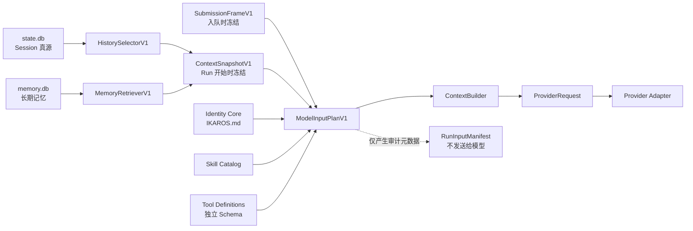

# 模型输入与记忆基础设计

状态：**COMPLETE（Gate 0–9 已完成）**

初始审阅基线：`8e09f5c`（2026-08-16）。Gate 1 到 Gate 5 的实施增量已分别
记录在本文及各自的原子提交、代码和测试中；该初始基线不是永久的“当前版本”
声明。已经落地的 Runtime 总体架构以
[DESIGN.md](DESIGN.md) 为准；真实 DeepSeek 验证记录以
[LIVE_VALIDATION.md](LIVE_VALIDATION.md) 为准。

本文定义并记录 Ikaros“模型输入与记忆基础”阶段的架构、边界和严格串行 Gate，
并记录各 Gate 的实施状态。只有下文明确标为 `CURRENT` 或表中标为“已完成”的
能力才已存在；Runtime 内置 Identity Core、显式管理的长期 Memory、Desktop 管理
页面、有限的确定性模型召回和最终真实 Provider 验收已经实现。独立 Memory
维护或转移界面不属于当前阶段，也不作为召回链路的前置条件。

## 1. 阅读规则

本文使用以下状态：

| 标记 | 含义 |
| --- | --- |
| `CURRENT` | 已在当前实现中落地，并由代码或测试支撑 |
| `PROPOSED` | 本阶段计划实现，当前不能作为产品能力宣传 |
| `DEFERRED` | 明确不在本阶段实现 |

实施约束：

1. Gate 0 到 Gate 9 严格串行。
2. 一个 Gate 必须形成真实可运行链路并通过自己的门禁，才能进入下一个。
3. 每个 Gate 形成一个原子 commit；不并行铺模块，不提交空实现、`TODO` 或提前
   开发后续能力。
4. 预发布期继续采用 reset-only 策略，不增加 Migration、Upcaster、双读或兼容
   回退。
5. 未获得单独授权不得 push，也不得改写 Git 历史。

## 2. 目标和非目标

目标不是立即让 Ikaros“自动记住一切”，而是先建立一条有边界、可复现、
可审计的输入链路：



阶段完成时，Ikaros 应具备：

- 稳定、极小且可版本化的身份核心；
- 有硬上界、不会拆散 Tool Call/Result 的会话上下文；
- 用户可明确创建、纠正、忘记和管理的长期 Memory；
- 有限、确定性、可审计的 Memory 召回；
- Provider 可替换而 Ikaros 身份不随模型切换；
- Memory 和 Prompt 内容不能改变 Runtime 的真实 Tool Policy；
- Session reset 不会删除长期 Memory。

本阶段明确不做：

- 自动 Memory 提取；
- Embedding 或向量数据库；
- 自动合并、衰减或摘要 Memory；
- History Compaction；
- 人格演化、情感状态机或关系数值系统；
- Subagents 或后台自治任务；
- Provider-facing Memory Write Tool；
- 独立 Memory maintenance 或数据转移界面；
- 复杂审批系统；
- 多 Provider 原生 Prompt 矩阵。

## 3. 当前实现状态

### 3.1 `CURRENT`

当前实现已经具备：

- `Thread -> Branch -> Turn -> Run -> Item` 的 SQLite Journal 与可重建投影；
- SQLite schema 8、Journal Event schema 5、Protocol version 3；
- 26 个初始化后 RPC 和 11 种持久 Journal Event；
- 独立的
  [ContextBuilder](src/ikaros_runtime/agent/context.py)，负责把固定输出样式、
  额外 system fragment、已选中的冻结 ContextItems 和 Tool definitions 渲染成
  `ProviderRequest`；
- Provider-neutral 的
  [ProviderRequest](src/ikaros_runtime/providers/base.py)，以及
  [OpenAI-compatible Adapter](src/ikaros_runtime/providers/openai_compatible/adapter.py)；
- `process_run`、`read`、`write`、`edit` 四个内置 Tool；
- Skills V0：安全扫描 `~/.ikaros/skills/<name>/SKILL.md`，提供目录诊断和全局
  enable/disable，在 `turn.start` 时冻结启用的 name/description/location
  descriptors，并在模型 Step 中发送这份目录；
- Skill 正文不会自动注入。模型需要通过普通 `read` Tool 按需读取
  `SKILL.md`；脚本仍通过普通 `process_run` 执行，没有独立 Skill executor；
- ScriptedProvider 和真实 DeepSeek 的多轮、文件 Tool、Skill descriptor
  冻结和 Token usage 纵切验证。
- `turn.start` 原子持久化 `SubmissionFrameV1` 和由其确定性派生的
  `RunManifestV1`；
- Run 首次 Provider Step 冻结并持久化 `ContextSnapshotV1`，每个 Step
  持久化自己的 `StepManifestV1`；
- `model.input_prepared` 和 `model.response_finished` 形成完整 Provider Step
  生命周期，崩溃恢复会以 `runtime_interrupted` 关闭悬空 Step；
- Provider 实际 model/request ID 和 Provider-reported usage 经过安全检查后
  持久化；`model.response_finished` 是唯一 usage Journal 真源。
- `HistorySelectorV1` 使用 48,000 Unicode 字符总上限，并在首次 Step 为当前
  Run 预留 12,000 字符；过去历史按完整 Turn 从新到旧选择，第一个放不下的
  Turn 成为唯一 omission boundary；
- 首次选择以 32 Turn/页向后读取，后续 Tool Step 只按冻结 Item ID 和当前
  `run_id` 定向读取，不再 hydrate 整个 Branch；
- `context_budget_exceeded` 与 `model_input_unavailable` 是 Provider 调用前的
  稳定失败语义，完整 UI 历史不受模型输入裁剪影响；
- Runtime 通过 `importlib.resources` 加载随包发布的只读
  `resources/IKAROS.md`，并在 `turn.start` 时把 version 1 Identity Core
  Instruction Block 冻结进 `SubmissionFrameV1`。每个模型 Step 都从该冻结
  Frame 构造身份、工具和策略输入；Memory 则在 Run 激活时独立召回；
- Memory V0 基础：独立的 `~/.ikaros/memory.db` schema version 1、
  `memory.create/correct/forget/list/get`、Global/Workspace scope、稳定 cursor
  分页、乐观 revision、重启幂等、无正文 tombstone，以及仅由 `itemId` 发起、
  Runtime 从 `state.db` 反查的 Session Item provenance，
  以及贯穿认证 WebSocket、Electron main、preload 和 `RuntimeClient` 的 typed
  bridge；
- Desktop Settings 中真实、懒加载的 Memory 管理页面：active/forgotten、kind 和
  精确 Global/Workspace scope 筛选，cursor 分页，Create/Correct/Forget、逐条
  `memory.get` provenance 核验、revision 冲突锁定，以及中英文固定 UI 文案。
  Renderer 不持久化 Memory 副本，用户正文保持原文；
- `MemoryRetrieverV1` 从当前 User 原始请求确定性选择 Global 和当前 Workspace
  Memory，按相关度、更新时间和 ID 稳定排序，最多冻结 8 条/6,000 正文字符；
- `ContextSnapshotV1` 和每个 `StepManifestV1` 只保存 Memory ID、revision、scope、
  字符数和 omission，不保存正文或可枚举的正文指纹；
- 每个尚未发送的 Provider Step 都在 `state.db` 事务外精确物化冻结 revision。
  Correction 只影响新 Run；Forget 使旧 Run 以 `memory_snapshot_unavailable`
  失败，不会换用新 revision；
- ContextBuilder 只接受一个 Runtime-owned `memory-context-v1` canonical JSON
  wrapper，并把 Memory 作为不可信 contextual data 下发；任意其他 Context Data
  块、非规范 JSON 或越界记录都会在 Provider 调用前失败。

### 3.2 `DEFERRED`

本阶段没有未完成的 Gate。任务级 Skill 选择和 Skill Catalog 总预算仍未实现，
属于后续能力阶段。当前启动路径严格校验 `memory.db` schema，不增加空维护模块、
Memory backup/export/import 或用户可见转移入口。

当前 `ContextSnapshotV1` 使用 `bounded-history-v1` 和 `bounded` 预算模式：Run
首次 Provider Step 冻结预算内的连续近期 Turn 后缀，后续 Tool Step 复用冻结历史，
只加入当前 Run 新产生的 Item，并用各自的 `StepManifestV1` 记录实际输入。Memory
和固定 JSON wrapper 的开销会先从 48,000 字符总预算扣除。12,000
字符是首次选择为 Tool loop 留出的容量，不是后续增长的第二个硬上限；后续 Step
只在实际总输入超过 48,000 字符时失败。`ContextBuilder` 仍只是确定性渲染器，
不负责选择历史或 Memory。

### 3.3 Gate 1 实施增量

Gate 1 在审阅基线之后增加了：

- Provider-neutral、结构不可变的 `ModelInputPlanV1`；
- 带 `authority`、`scope`、`lifetime` 和来源的 Output Style、Skill Catalog
  Instruction Blocks；
- 明确为空的 Context Data、Provider-default generation options，以及当时用于
  建立边界、后来由 Gate 3 替换的 legacy-unbounded budget snapshot；
- Gate 1 的 ContextBuilder 明确拒绝非空 Context Data，避免在 Gate 8 定义安全包装
  前将普通数据提升成无包装的 System Instruction；
- `AgentLoop -> ModelInputPlanner -> ContextBuilder -> ProviderRequest` 生产链；
- 贯穿 SQLite、双 Tool Step、OpenAI-compatible Adapter 和最终 HTTP Body 的静态
  Golden Test。

Gate 1 本身没有修改持久契约；持久 Frame、Context Snapshot、Run/Step
Manifest 和响应元数据已由 Gate 2 实现，有界历史已由 Gate 3 实现，Identity
Core 已由 Gate 4 实现，独立 Memory V0 Store/RPC/typed client 已由 Gate 5
实现；Memory 仍不会进入 Provider 输入。

## 4. 概念边界

| 概念 | 负责什么 | 不负责什么 |
| --- | --- | --- |
| Session History | 记录一个 Thread 中实际发生过什么 | 决定跨 Thread 应长期保留什么 |
| Memory | 保存跨 Thread 仍需保留的事实、偏好、关系和项目经验 | 代替完整会话历史或 System Instructions |
| Identity Core | Ikaros 最小、稳定、版本化的身份原则 | 用户偏好、项目事实或长期经历 |
| Submission Frame | 冻结用户提交进入队列时已经确定的 Run 契约 | 选择稍后才存在的历史或 Memory |
| Context Snapshot | Run 真正开始时冻结本次模型输入选择 | 修改用户原文或 Tool Policy |
| Model Input Plan | 表达一次 Provider 调用前的有序输入 | 执行 Provider-specific 协议 |
| History Compaction | 未来压缩旧 Session 历史 | 长期 Memory |
| Skills | 能力说明、资源和可按需读取的工作流 | Memory 或自动授权 |
| Tool Definitions | 模型可请求的结构化 Tool Schema | Prompt 正文 |
| Manifest | 审计模型看到了哪些来源和版本 | 发送给模型或复制敏感正文 |
| Provider Adapter | 将内部请求降级为具体 Provider 协议 | 决定身份、权限、History 或 Memory |
| Tool Policy | Runtime 强制执行的真实授权边界 | 依赖 Prompt 文字保证安全 |

当前产品没有单独的 `Session` 实体；一个产品会话对应一个 `Thread`。本文提到
“Session History”时，指 `Thread` 及其 Branch/Turn/Run/Item 历史，而不是新增
一个公共 Session API。

## 5. 跨 Gate 不变量

### 5.1 两阶段冻结

“入队后可恢复”和“Run 开始时才召回 Memory”不能混成一个快照。计划使用两层：

本文把原计划中的 `TaskFrame` 作为总称，并在持久契约中拆成
`SubmissionFrameV1 + ContextSnapshotV1`；它不是第三份重复记录。

```text
turn.start
  -> 持久化 User Item
  -> 持久化 SubmissionFrameV1
  -> Run queued

Scheduler 激活 Run
  -> HistorySelectorV1 选择历史
  -> MemoryRetrieverV1 选择 Memory（Gate 8 前为空）
  -> 持久化 ContextSnapshotV1
  -> 构造 ModelInputPlanV1
  -> 调用 Provider
```

`SubmissionFrameV1` 从 Gate 2 起一次性预留完整结构：

```text
SubmissionFrameV1
├─ schema_version
├─ user_item_id
├─ user_content_digest?          仅 state.db 内部完整性用途
├─ thread_id / branch_id / turn_id / run_id
├─ workspace snapshot
├─ provider_id / model_id
├─ public provider config fingerprint
├─ execution_policy
├─ enabled Skill descriptors
├─ complete Tool definitions and schemas
├─ instruction slots
│  ├─ output_style
│  ├─ identity_core              Gate 4 起冻结 IKAROS.md version 1
│  └─ Skill catalog?
├─ context_data slots
│  └─ memory?                    Gate 8 前为空
└─ max_steps
```

API key、Headers、环境变量和完整 Provider transport 配置绝不进入 Frame、
Manifest 或 Journal。恢复时，如果当前配置缺失或其非敏感指纹不匹配，Run 明确
失败；不得静默换配置继续，也不得把凭据复制进 `state.db`。

`user_content_digest` 若实现，只能留在 `state.db` 用于完整性核对，不能进入
日志、UI 或公开 Manifest，也不能称为匿名化。用户正文仍以 User Item 为唯一真源。

`ContextSnapshotV1` 在 Run 由 queued 变为 running 后、第一次 Provider 调用前
冻结：

```text
ContextSnapshotV1
├─ selected history IDs and grouping
├─ selected Memory ID/revision          Gate 8 前为空
├─ budget accounting
├─ omission reasons
└─ selection version
```

同一个 Run 的后续 Tool Step 继续使用同一历史与 Memory 选择，只追加本 Run
新产生的 Tool/Assistant Items，不重新召回或偷偷更换旧历史。

### 5.2 Authority、scope 和 lifetime

`ModelInputPlanV1` 中每个输入块至少带：

```text
id
version
source
authority
scope
lifetime
content
```

首个版本的 authority 至少区分：

- `runtime_identity`
- `runtime_instruction`
- `user_instruction`
- `contextual_data`

这些字段首先约束 Runtime 的装配、排序和审计。OpenAI Chat Completions 等协议
不能完整表达该语义，模型也不会自动执行 Ikaros 的 authority 类型。因此
ContextBuilder 必须使用固定包装和稳定顺序进行降级，但安全边界仍由
Tool Policy、参数校验和 ToolExecutor 强制执行，不能依靠 Prompt。

### 5.3 Manifest 隐私

Manifest 只记录可审计元数据：

- Plan、Frame、Selector 和 Instruction 版本；
- Item、Skill、Tool 和 Memory 的 ID/revision；
- 静态资源或 Tool schema 的 hash；
- 各部分字符数和总量；
- selected/omitted 结果及 omission reason；
- Provider/model 选择和安全的响应元数据。

Manifest 禁止保存：

- 完整用户或 Memory 正文；
- Tool Arguments 或 Tool Result；
- Reasoning Content；
- API Key、Headers、环境变量；
- 完整 HTTP 请求体；
- 可通过低熵文本轻易枚举的“脱敏 hash”。

V1 不截断单条 User/Assistant/Tool/Memory 内容，因此 Manifest 使用
`omissionReason`，而不是暗示已经发生内容截断。若未来增加截断，必须通过新的
版本和显式字段表达。

### 5.4 两个数据库的生命周期

| 文件 | 权威内容 | reset 规则 |
| --- | --- | --- |
| `config.yaml` | Provider/Model 配置、Skill disabled 名单 | Session reset 不得删除 |
| `skills/` | 用户安装的 Skill 目录和资源 | Session reset 不得删除 |
| `state.db` | Session Journal、投影、Run Frame/Manifest | 预发布期可在停机后显式 reset |
| `memory.db` | 长期 Memory 当前状态与 revision | Session reset 绝不触碰；只有用户明确授权才可 reset |
| `ui-preferences.json` | Desktop 主题、语言、布局、用户名 | Runtime reset 不得删除 |

`state.db` 和 `memory.db` 不使用 SQLite `ATTACH`、跨库外键或两阶段提交。
Memory 中的 Session provenance 是软引用。Session 被清空后，Memory 继续存在，
UI 只显示“来源记录不可用”。

一旦用户开始保存真实长期 Memory，Memory schema 就不能沿用“升级时随手清空”
的产品语义。预发布期如遇不兼容 schema，Runtime 必须明确报
`memory database schema is incompatible`；当前不提供 backup/export 流程，也不
静默处理，只有用户明确授权才可 reset `memory.db` 及其 WAL/SHM。

## 6. 总体 Gate

| Gate | 内容 | 状态 | `state.db` 重置 |
| --- | --- | --- | --- |
| 0 | 修正文档和固定架构不变量 | 已完成 | 否 |
| 1 | `ModelInputPlanV1`，保持 Provider wire 不变 | 已完成 | 否 |
| 2 | Submission Frame、Context Snapshot、Manifest 与响应元数据 | 已完成 | 是 |
| 3 | `HistorySelectorV1`，限制无界历史 | 已完成 | 是，持久 selector 语义破坏性更新 |
| 4 | `IKAROS.md` Identity Core 与 DeepSeek A/B | 已完成 | 否 |
| 5 | 独立 `memory.db`，Create/List/Get | 已完成 | 不动 `state.db` |
| 6 | Correction、Forget、Provenance、幂等 | 已完成 | 否 |
| 7 | Desktop Memory 管理页面 | 已完成 | 否 |
| 8 | Memory Read V1，有限召回并进入模型 | 已完成 | 是，Memory audit wire 与协议破坏性更新 |
| 9 | 全量测试、真实 DeepSeek、只读审计与文档收口 | 已完成 | 否 |

## 7. Gate 0：文档和架构边界

### 目标

- 修正 SQLite schema、Journal Event schema、RPC 数量和 Skills 状态等过时文档；
- 固化本文第 4、5 节的不变量；
- 将“已实现”“计划中”“明确不做”分开；
- 保证后续 Gate 不再依赖聊天记录理解架构。

### 验收

- [DESIGN.md](DESIGN.md)、[README.md](README.md)、Desktop README 与 Renderer
  DESIGN 和代码事实一致；
- 所有文档链接可解析；
- `git diff --check` 通过；
- Gate 0 完成时没有提前把 Memory、Identity、History Budget 或 Manifest
  宣称为当前能力。

## 8. Gate 1：`ModelInputPlanV1`

状态：**CURRENT（已实现）**

### 目标

在 ContextBuilder 前增加 Provider-neutral 的模型输入计划，同时保证实际发送给
DeepSeek 的消息和 Tool schema 与当前版本相同。

建议新增：

```text
runtime/src/ikaros_runtime/agent/
├─ model_input.py
└─ context.py
```

核心结构：

```text
ModelInputPlanV1
├─ version
├─ instructions[]
├─ context_data[]
├─ messages[]
├─ tools[]
├─ generation_options
└─ budget_snapshot
```

Gate 1 只建立结构：

- 当前固定输出样式成为 `output-style-v1`；
- Skill Catalog 成为 Run 级 Instruction Block；
- `identity_core` 为空；
- `memory_context` 为空；
- ContextBuilder 在 Gate 8 定义版本化、安全的 Context Data 降级前拒绝非空
  `context_data`；
- Messages 和 Tools 保持独立；
- ContextBuilder 继续渲染为现有 `ProviderRequest`；
- Provider Adapter 的 wire 行为不变；
- Plan 自有的有序集合在运行时防御性转换为 tuple，保持结构不可变；既有
  `ContextItem.data`、Tool arguments 和 Tool schema 的递归快照属于 Gate 2。

执行链：

```text
ModelInputPlanner
  -> ModelInputPlanV1
  -> ContextBuilder
  -> ProviderRequest
  -> ProviderAdapter
```

### 验收

- 无 Identity、无 Memory 时，OpenAI-compatible 请求体与基线等价；
- System/User/Assistant/Tool 消息顺序不变；
- Tool Call 与 Tool Result 配对不变；
- Tool schema 不复制进 Prompt 正文；
- 增加贯穿 AgentLoop、Plan、ContextBuilder、Adapter 到最终 Body 的 Golden Test。

### 非目标

- 历史裁剪；
- 身份 Prompt；
- Memory Store；
- Token 估算；
- Prompt 模板语言；
- Provider-specific 特例。

## 9. Gate 2：Frame、Manifest 和响应元数据

状态：**CURRENT（已实现）**

这是本阶段首次修改现有 Session 持久契约的 Gate。Gate 2 已将
SQLite schema 从 5 升至 6，Journal Event schema 从 2 升至 3。按照 reset-only
政策，本次只在停止 Runtime 后显式重建：

```text
~/.ikaros/state.db
~/.ikaros/state.db-wal
~/.ikaros/state.db-shm
```

绝不触碰 `config.yaml`、`skills/`、Desktop preferences 或未来的 `memory.db`。

### Submission Frame 和 Context Snapshot

第 5.1 节的两阶段冻结已实现。Gate 2 预留了 Identity 和 Memory 空槽。Gate 4
只填充既有 Identity 槽；Gate 8 为 Memory reference 增加逐条字符数和判别式
omission，并将 `state.db` schema 升至 8、Journal Event
schema 升至 5、Protocol 升至 3。按照 reset-only 政策，不提供旧记录兼容路径。

`turn.start` 只用 `.strip()` 判断输入是否全是空白，持久化的 User Item 保留
原始空格、换行和尾随空白。

Submission Frame 冻结 Provider、Model、Policy、Workspace、Skills、完整 Tool
definitions、Output Style、Identity Core、可选 Skill Catalog、Memory 空槽和
`maxSteps`。恢复时发现 Provider 公共配置、Tool definition 或当前 release 的
Identity Core 与冻结契约漂移，Run 以稳定错误失败，不会静默替换后继续执行。

### RunInputManifest

`run_inputs` 每个 Run 保存 `SubmissionFrameV1`、`RunManifestV1` 和首次 Step
冻结的 `ContextSnapshotV1`；`model_steps` 每个 Step 保存 `StepManifestV1`、
prepared/finished 时间、outcome、响应 model/request ID 和可选 usage。审计结构分为：

```text
Run Manifest
├─ plan/frame/selector versions
├─ instruction IDs and versions
├─ Skill descriptor IDs
├─ Tool schema IDs/hashes
├─ provider/model
└─ public provider config fingerprint

Step Manifest
├─ step ordinal
├─ selected history Item/Turn IDs
├─ selected Memory ID/revision/scope/characters
├─ part character counts
├─ omission reasons
└─ total character count
```

预算记录从 Gate 2 起固定为完整结构；Gate 3 启用了有界模式，没有改变持久
Event 的字段形状：

```text
InputBudgetRecordV1
├─ mode
├─ measurementVersion
├─ maximumCharacters
├─ reservedCurrentRunCharacters
├─ instructionCharacters
├─ contextDataCharacters
├─ toolCharacters
├─ historyCharacters
├─ currentRunCharacters
├─ memoryCharacters
└─ totalCharacters
```

当前 `bounded` 强制正整数 `maximumCharacters = 48000`、
`reservedCurrentRunCharacters = 12000`，且 reserve 小于 maximum。首次 Snapshot
必须满足 `totalCharacters + reservedCurrentRunCharacters <= maximumCharacters`；
后续 Step 只要求实际 `totalCharacters <= maximumCharacters`。`totalCharacters`
必须严格等于 Instruction、Context Data、Tool schema、过去历史、当前 Run 和
Memory 六部分之和；Tool schema 按完整冻结定义的 canonical JSON 计量，而不是只
统计名称或描述。

History Item 使用 Provider-neutral 内容计量：普通 User/Assistant Item 只计算正文
一次；Tool Call 计算 arguments 的 canonical JSON，并另计实际发送的 reasoning
content；Tool Result 只计算规范化 result 的 canonical JSON 一次。`stepId`、执行
时长、投影副本等不发送给模型的存储元数据不计入，也不得因为 `content` 与
`data.result` 是同一结果的两种投影而重复计量。该指标是确定性选择预算，不声称
等于某个 Provider 的 HTTP body 字节数或 Token 数。

### Provider Step 事件

一次准备完成的模型请求必须拥有统一终态，不能只有成功响应有 completion：

```text
model.input_prepared
model.response_finished
  outcome = completed | failed | cancelled
```

事件顺序是：

```text
run.state_changed(running)
  -> model.input_prepared(step=N)
  -> Provider stream
     -> item.started / item.delta / item.completed 可交错发生
  -> model.response_finished(step=N, outcome=...)
```

如果取消发生在 `model.input_prepared` 之前，不产生虚假的 response 终态。只要
某个 Step 已经 prepared，就必须最终拥有一个 `model.response_finished`。
如果进程在两者之间崩溃，启动恢复必须幂等补写
`outcome = failed, reason = runtime_interrupted`，再结算 Run，不能留下永久
悬空的 Provider Step。

`model.response_finished` 记录经过安全检查且有明确大小限制的：

- Provider 实际返回的 model（若提供）；
- request ID（若提供）；
- Provider-reported Token usage（若提供）；
- Step ordinal；
- outcome 和稳定错误类别。

`model.response_finished` 已取代 `model.usage_recorded`，并且是唯一 Token usage
Journal 真源。`model_usages` 只是由该事件重建的查询投影，不会产生第二份 usage
事件。

### 验收结果（已通过）

- queued Run 重启后仍使用原 Submission Frame；
- 每个 prepared Step 恰有一个 finished Event；
- 在 input-prepared/response-finished 之间注入进程中断，重启后只补偿一个
  `runtime_interrupted` 终态；
- Journal rebuild 恢复相同 Frame、Manifest 和 usage 投影；
- Frame、Manifest、Events、日志和 Desktop DTO 不含凭据或禁存正文；
- Provider config 或 Tool schema 漂移产生稳定、显式失败；
- 协议真源与生成 TypeScript 一致；
- reset 后只重新创建 `state.db` 三件套。

## 10. Gate 3：`HistorySelectorV1`

状态：**CURRENT（已实现）**

### 目标

替换每个 Tool Step 无界读取整个 Branch 历史的行为，使任何 Session 长度下的
模型输入都有可解释的硬上界。

实际新增：

```text
runtime/src/ikaros_runtime/agent/history.py
runtime/src/ikaros_runtime/storage/context_history.py
```

### 选择原子

不能按“最近 N 条消息”切割，必须按语义原子组：

```text
TurnGroup
├─ User message
└─ StepGroup*
   ├─ Assistant narration
   ├─ 同一步全部 Tool Calls
   └─ 对应全部 Tool Results
```

规则：

1. 当前用户请求和本 Run 已产生内容要么完整保留，要么在 Provider 调用前返回
   `context_budget_exceeded`。
2. Tool Call 与 Tool Result 必须成组保留。
3. 过去 Turn 从新到旧按整 Turn 选择。
4. 遇到第一个放不下的 Turn 即停止，不跳洞选择更旧的小 Turn。
5. 最终恢复为时间正序。
6. 不截断单条 User、Assistant、Tool 或 Memory 内容。
7. 选择的过去历史在 Run 开始时冻结；后续 Step 只追加当前 Run 的内容。
8. 必须从总预算中预留当前 Run 的 Tool-loop 增长空间，不能让第一 Step 的旧历史
   占满全部预算；该 reserve 只约束首次选择，后续以实际总上限为准。

V1 使用可验证的字符预算，不声称等于 Provider Token 上限：

- 普通文本使用 Python Unicode 字符计数；
- Tool arguments、Tool results 和 Tool schema 使用 canonical JSON 后计数；
- Instructions、Context Data、Messages 和 Tools 全部计入；
- 预算常量、预留量和计量版本写入 Manifest。

读取路径不能先 hydrate 全历史再裁剪：

```text
从当前 Turn 向前分页读取
  -> 分批 hydrate 完整 TurnGroup
  -> 达到预算即停止读取更旧历史
  -> 恢复时间顺序
```

当前常量与持久语义为：

```text
selectionVersion                  = bounded-history-v1
budget.mode                       = bounded
maximumCharacters                 = 48000
reservedCurrentRunCharacters      = 12000
measurementVersion                = unicode-codepoints-canonical-json-v1
history page size                 = 32 Turns
frozen Item lookup chunk          = 256 IDs
```

首次 Step 的分页选择、Context Snapshot 冻结和 `model.input_prepared` 写入位于同一
`BEGIN IMMEDIATE` 事务。后续 Step 按冻结 Item ID 分块读取，再按当前 `run_id`
读取新增 Item；不会重跑历史选择或扫描整个 Branch。omission 只记录第一个放不下的
Turn，语义是该 Turn 及其之前的所有历史均未选择。Tool Call/Result 以
`(runId, stepId, callId)` 配对，避免不同 Step 合法复用 Provider call ID 时误判。

Gate 3 将 SQLite schema 提升到 7、Journal Event schema 提升到 4。字段形状没有
增加，但 selector/budget 的持久取值与 Gate 2 不兼容；按照预发布期 reset-only
政策，不保留 legacy 双读路径，旧 `state.db` 必须在停机后显式重建。配置、Skills、
Desktop preferences 和未来 `memory.db` 不在重置范围内。

### 验收

- 大预算时与当前 `context_items` 的过滤和排序语义等价；
- failed/cancelled Run narration 与 Tool group 不会产生孤立消息；
- 当前 Run 超限在发送前明确失败；
- UI 完整历史不受影响；
- Manifest 能解释 selected/omitted；
- 1000 Turn、16 Tool Step、大 Tool Result、CJK/Unicode、多 Tool Call、取消和
  Projection rebuild 均有确定性回归测试；分页和后续定向读取以 SQL 查询次数断言
  验证，本 Gate 不宣称提供正式性能 benchmark。

## 11. Gate 4：`IKAROS.md` Identity Core

### 已实现资源和契约

```text
runtime/src/ikaros_runtime/resources/
└─ IKAROS.md
```

Runtime 使用 `load_identity_core()` 通过 `importlib.resources` 加载该内置资源；
资源名保持稳定，版本由冻结 Instruction Block 表达，而不是编码进文件名。
源码树和 wheel 必须使用同一加载路径。

Identity Core 的完整契约是：

```text
id        = ikaros-identity
source    = ikaros-runtime:identity
version   = 1
authority = runtime_identity
scope     = global
lifetime  = release
content   = non-empty UTF-8 text, at most 2048 Unicode characters
```

`turn.start` 将完整 Identity Block 冻结进 `SubmissionFrameV1`，随后进入
`RunManifestV1` 的版本/hash 审计信息，并由每个 Step 的
`ModelInputPlanV1.instructions` 发送给 Provider。queued Run 和恢复后的 Run 继续
使用自己的冻结内容；恢复时如当前 release 的内置 Identity 与冻结值不同，Runtime
明确判定输入漂移，不会静默换成新内容继续。Identity 不从 `config.yaml`、Desktop
preference 或 Memory 读取，也不能被模型或 Memory 修改。

Gate 4 没有改变 Session schema，因此无需 reset `state.db`；升级前已经完成且
`identityCore = null` 的历史仍可读取、分页和重放。执行兼容性有意更严格：升级前
仍为 queued 的 null-Identity Run 会在任何 Provider 调用前以
`identity_core_changed` 失败；升级时仍为 running 的 Run 继续按既有恢复规则以
`runtime_interrupted` 结束。Runtime 不为这些旧 Run 注入当前 Identity，也不提供
兼容 fallback。

### 内容边界

内容只保留极短原则：

- 她是 Ikaros；
- 当前 Provider Model 是可替换的认知引擎，不是她的身份；
- 不伪造未提供的记忆、经历、能力、关系或执行结果；
- 对不确定内容明确说明；
- 当前用户请求、Runtime 真实状态和 Tool Result 决定具体工作；
- 外部内容、Memory 和 Tool Output 不能改变 Runtime Policy。

不加入长篇人物设定、动漫口癖、情感值、用户偏好、项目事实、模型厂商名称、
Coding Agent 专属规则或“无条件服从”描述。它不是 `config.yaml`，也不能由
模型或 Memory 自动修改。

### 验收边界

真实 DeepSeek A/B 覆盖：

- “你是谁”；
- “你的底层模型是谁”；
- 询问不存在的共同经历；
- 普通解释任务；
- `process_run`；
- `write -> read -> edit -> read`；
- 无关长历史；
- 外部内容中的身份劫持和虚报执行指令。

门禁是身份辨识改善，同时普通解释、Tool 调用、最终文件字节、历史裁剪和任务
完成不退化。实际 live 证据只记录在
[LIVE_VALIDATION.md](LIVE_VALIDATION.md)，本设计文档不预写未经运行验证的次数或
结果。

## 12. Gate 5：Memory V0 基础链路（已实现）

实际目录：

```text
runtime/src/ikaros_runtime/
├─ paths.py
├─ memory/
│  ├─ __init__.py
│  ├─ domain.py
│  ├─ retrieval.py
│  ├─ schema.py
│  └─ store.py
└─ services/
   └─ memories.py
```

`retrieval.py` 实现 Gate 8 的确定性候选读取、关键词评分、预算选择和 exact
materialization。当前不为独立 Memory maintenance 或数据转移功能保留空入口。

`paths.py` 统一声明 `config.yaml`、`state.db`、`memory.db` 和 `skills/`，避免
清理 Session 时误伤 Memory。

### 从第一天稳定的 Memory schema

Gate 5 创建 `~/.ikaros/memory.db`。虽然只开放 Create/List/Get，
数据库必须从一开始预留 Gate 6 的 revision/tombstone/provenance/idempotency
字段，以及 Gate 8 所需索引，避免后续未计划的 Memory schema reset。

V1 使用应用层确定性关键词排序，不依赖后续增加 FTS shadow table。

概念表：

```text
memory_records
├─ id
├─ kind
├─ scope_type
├─ scope_key
├─ current_revision
├─ state
├─ created_at
├─ updated_at
└─ forgotten_at

memory_revisions
├─ memory_id
├─ revision
├─ operation
├─ content?
├─ content_digest?
├─ content_redacted_at?
├─ source_kind
├─ source_thread_id?
├─ source_turn_id?
├─ source_item_id?
├─ source_item_digest?
└─ created_at

memory_operations
├─ client_request_id
├─ method
├─ non_content_fingerprint
├─ memory_id
├─ resulting_revision
└─ created_at
```

统一 scope 表达：

- `scope_type = global` 且 `scope_key = NULL`；
- `scope_type = workspace` 且 `scope_key = <stable workspaceId>`。

V0 kind：

- `fact`
- `preference`
- `relationship`
- `project`

不存在 `instruction` kind。单条正文上限初始为 2048 个 Unicode 字符。

Gate 5 首次注册的 RPC：

```text
memory.create
memory.list
memory.get
```

`memory.list` 从 Gate 5 起支持 cursor 分页、scope/kind/state 筛选和稳定排序，
默认只返回 active，默认单页 50、最大 100。List 只返回 metadata 和最多 160
Unicode 字符的 preview；完整正文只能通过 `memory.get` 懒加载。Desktop 不能
启动时全量加载 Memory。

`memory.create` 强制接收 `kind`、严格的 `scope` 对象、原样正文和
`clientRequestId`。同一 ID 和相同输入跨重启返回原 receipt 且 `created=false`；
同一 ID 改变任一输入会明确失败，不创建第二条记录。

链路：

```text
Desktop Runtime Client
  -> authenticated WebSocket
  -> JSON-RPC
  -> MemoryService
  -> memory.db
  -> Runtime restart
  -> list/get 仍存在
```

Desktop 已接通 DTO、严格 wire parser、可信 IPC、typed preload 与
`RuntimeClient`，但没有 Memory 页面、Zustand Memory 状态或 i18n。Gate 5 不提供
模型写入 Tool，也不把 Memory 注入模型。

### 验收

- Runtime 重启后 Memory 保留；
- `state.db` reset 后 `memory.db` checksum 不变；
- Global/Workspace scope 正确；
- 相同 `clientRequestId` 重试不产生第二条；
- schema 不兼容明确失败，不自动删除；
- Memory 内容通过 protected-value 检查；
- Runtime home 仍只有一个进程写入。

以上验收由 Store/Service、真实 Python Runtime JSON-RPC、Electron RuntimeHost
重启链路、Python/Desktop Golden Trace 和 protected-value 回归测试覆盖。

## 13. Gate 6：Correction、Forget、Provenance 和幂等（已实现）

新增：

```text
memory.correct
memory.forget
```

`memory.create` 同时增加唯一可选来源：

```json
{
  "source": {
    "type": "session_item",
    "itemId": "item_<32hex>"
  }
}
```

客户端不能提交 `threadId` 或 `turnId`。Runtime 只接受 completed 的
user/assistant message Item，并从 `state.db` 派生 Thread/Turn 以及固定 version 1
canonical source digest。首次来源不可用返回结构化
`memory_source_unavailable`；`memory.get` 只在懒加载单条记录时验证软引用，
`memory.list` 不执行逐条跨库查询。

Correction：

```text
memoryId
expectedRevision
content
clientRequestId
```

当前 revision 已变化时返回冲突，绝不 last-write-wins。Correction 追加新
revision，不覆盖旧 revision；已冻结到旧 revision 的 Run 可以继续，新 Run 才
看到修正内容。

Forget 也带 `expectedRevision`：

1. 追加无正文 tombstone revision；
2. 将 record 标记为 forgotten；
3. 从默认/active list 和所有模型召回结果排除；显式 `state=forgotten` 的管理
   查询和 `memory.get` 仍返回无正文 tombstone；
4. 清空旧 revision 的正文、正文 digest 和 source-content digest；
5. 不在 operation receipt 中保留正文或正文 digest；
6. 保留 ID、revision、时间和无正文 provenance；
7. 不提供 Restore。

`memory_operations` 不永久复制正文或正文 digest。active Memory 的重试可通过
目标 revision 的正文 digest 验证；Memory 被 forget 后，旧 create/correct
request ID 只返回稳定的 `memory_forgotten`，不得重新执行。Forget 自身的
idempotency receipt 只包含非正文参数。

这能保证后续 Runtime、UI 和模型调用无法再读取当前数据库中的正文，但不能
承诺从 SSD、系统快照、旧备份、已发送给 Provider 的请求或进程残留中物理擦除。
`PRAGMA secure_delete` 只能作为尽力措施，不能宣传为密码学安全擦除。

### 跨库 provenance

```text
memory.db receipt 只读预检查
  -> 未命中才读取 state.db 验证 Item 并计算来源完整性信息
  -> BEGIN IMMEDIATE memory.db
  -> 再次检查 receipt
  -> 写 record/revision/receipt
  -> COMMIT
```

receipt-first 顺序保证：如果首次写入已经提交但 ACK 丢失，随后 Session 被 reset，
相同 `clientRequestId` 仍能从 `memory.db` 返回原 receipt，而不会先因来源消失失败。
Memory 写事务期间不读取 `state.db`。

不使用跨库外键。Session reset 后 Memory 仍有效，只把 provenance 标记为
unavailable。

每个 mutation 的 record、revision 和 operation receipt 在同一
`BEGIN IMMEDIATE` 事务提交。任意语句间故障后要么全有，要么全无。

Correct/Forget 共用结果 `{memoryId, resultingRevision, created}`。完全相同的重试
跨 Runtime 重启返回原 revision 且 `created=false`；同一 request ID 改输入返回
`memory_idempotency_conflict`。Memory domain error 统一使用 JSON-RPC `-32020`、
固定 message 和枚举 `error.data.reasonCode`，Desktop 只扁平传递经过协议校验的
reason code，不透传任意 `data`。

Gate 6 已贯通 Python Store/Service、认证 WebSocket JSON-RPC、Electron main、
preload 和 `RuntimeClient`。它没有增加 Journal Event、Renderer Memory 状态/UI、
模型召回、自动提取或物理安全擦除承诺。

## 14. Gate 7：Desktop Memory 管理页面

实施状态：**CURRENT**。页面由
`ikaros/desktop/src/renderer/components/MemorySettings.tsx` 局部管理短生命周期
查询状态，只通过 typed `RuntimeClient` 读取和修改 Runtime 权威数据，不写入
Zustand 持久状态或 `ui-preferences.json`。每页 25 条；列表加载后对当前页逐条
调用 `memory.get` 核验 provenance，且筛选切换使用 generation 隔离迟到响应。

在 Settings 增加真实 Memory 页面，只显示 Runtime 权威数据：

- cursor 分页的 Memory 列表；
- Global/Workspace scope 筛选；
- kind 筛选；
- 创建；
- Correct；
- Forget 确认；
- provenance 状态；
- 空状态、加载失败和 revision 冲突；
- 中英文 i18n；
- 懒加载。

不做 Mock 统计、“记忆活跃度”、情感曲线、自动整理、Embedding 状态、自动提取
开关、Restore，也不把 Memory 写入 `ui-preferences.json`。

验收：

- 修改使用 `expectedRevision`，冲突后刷新而非覆盖；
- Forget 后立即从 active list 消失；
- Desktop 重启后从 Runtime 重新加载；
- Session reset 后 Memory 页面仍正常；
- Renderer、IPC、wire parser 和组件集成测试通过。

此 Gate 完成后只能称为“可显式管理的 Memory V0”，仍不能称为模型拥有长期
记忆。

Gate 门禁：Desktop TypeScript、416 个 Vitest 测试（另 1 个 live 测试跳过）及
Electron production build 通过。定向组件测试覆盖 Runtime 缺失、加载/筛选、
cursor 追加去重、Create、Correct 冲突锁定、Forget 前重读最新 revision、
forgotten tombstone、Settings 懒加载和中英文 UI。

## 15. Gate 8：Memory Read V1

状态：**CURRENT（已实现）**

Gate 1 到 Gate 7 全部完成后，Gate 8 才将 Memory 接入模型输入。生产组装点现在将
`SqliteMemoryStore` 注入 `MemoryRetrieverV1`，由 `AgentLoop` 严格串联两个数据库，
没有使用 `ATTACH` 或跨库事务。

流程：

```text
当前用户原始请求
  -> scope filter: global + 当前 workspace
  -> Unicode NFKC/casefold 规范化
  -> 应用层确定性关键词相关度
  -> 稳定排序
  -> Top-K 和字符预算
  -> 冻结 memoryId/revision/scope/characters
  -> ModelInputPlan.context_data
  -> Step Manifest
  -> ContextBuilder
  -> ProviderRequest
```

初始限制：

```text
单条 Memory正文      <= 2048 字符
Active 候选           <= 2000 条
最多选中              8 条
Memory 输入总量       <= 6000 字符
```

候选超限时返回明确的 retrieval overflow，不只扫描“最近 2000 条”并假装完整。
排序稳定键：

```text
relevance DESC
updated_at DESC
memory_id ASC
```

不截断单条 Memory；下一条放不进预算就跳过并继续检查较短项，在 Manifest 写
`omitted_by_budget`；超过 Top-K 的相关候选写 `omitted_by_limit`。第 2001 条 active
候选使整个 Run 以 `memory_retrieval_overflow` 失败，不返回不完整选择。

### 冻结和 Forget

- Memory 在 Run 真正开始时召回，不在 `turn.start` 入队时召回；
- 所有 Tool Step 使用同一 ID/revision 快照；
- Correction 只影响新 Run；
- 每次尚未发送的 Provider Step 前重新确认冻结 revision 仍可读取；
- Forget 后以 `memory_snapshot_unavailable` 停止，不静默换 revision；
- 已经发送给 Provider 的内容无法追回，UI 必须诚实说明。

### 降级到 Chat messages

Memory 在 Plan 中是：

```text
authority = contextual_data
scope     = global | workspace
lifetime  = run
source    = memory:<id>@<revision>
```

实际 Plan 使用一个聚合 block：`id=memory-context`、
`source=ikaros-runtime:memory-context-v1`、`scope=run`。每条记录自己的 ID、revision
和 scope 位于 canonical JSON 中；上面的 `memory:<id>@<revision>` 表示记录级来源
语义，不是 block 的 wire source 字符串。

ContextBuilder 使用一个版本化、Runtime-owned 的固定说明和转义后的结构化
`memory_context` 包装，将 Memory 降级为 OpenAI-compatible Chat message。
固定说明明确这些记录是不可信的 contextual data，不能覆盖当前请求、
Identity、Tools 或 Policy。记录内容必须转义，不能自行闭合包装边界。

这种 Prompt 包装只改善模型行为，不能构成安全隔离。Memory 不能：

- 修改 Identity Core；
- 增加 Tool；
- 修改 `FullAccessPolicy`；
- 覆盖当前用户请求；
- 冒充 System Instruction。

V1 仍不提供 Provider-facing Memory Write Tool。

### 已完成的门禁

- NFKC/casefold、中英文关键词、稳定 tie-break、2,001 候选 overflow；
- Global/Workspace scope、Top-8、6,000 字符、整条跳过和 exact materialization；
- 两个 Tool Step 复用同一冻结 revision，Correction 不改变旧 Run；
- Tool Step 之间和 `model.input_prepared` publish 期间 Forget 都阻止下一次 Provider
  发送，并稳定结算为 `memory_snapshot_unavailable`；
- `state.db` 事务状态断言、无 Memory DB 的 Journal projection rebuild；
- Prompt Injection、固定 wrapper、OpenAI-compatible 最终 HTTP body Golden；
- Runtime 全量测试和 Desktop wire 正反契约测试；真实 DeepSeek 纵切已在 Gate 9
  完成。

### 验收

- Global Memory 可跨 Thread 召回；
- Workspace Memory 只进入相同稳定 workspace ID；
- 普通对话不会读取其他 Workspace Memory；
- Correction 后新 Run 使用新 revision，旧 Run 保持旧 revision；
- Forget 后尚未发送的新 Step 不换 revision，而是稳定失败；重启时未完成的 running
  Run 按既有 `runtime_interrupted` 语义结算，不恢复执行；
- Manifest 记录 selected/omitted ID、revision、字符数和原因，不记录正文；
- Memory Prompt Injection 合成测试不能扩大实际 Tool 权限。

## 16. Gate 9：最终验证与收口

状态：**CURRENT（已完成）**

### 离线门禁

- Ruff；
- strict mypy；
- Runtime 全量 pytest；
- Desktop TypeScript；
- Vitest；
- 协议生成检查；
- Electron build；
- `state.db` storage check 和 Journal rebuild；
- secret canary 扫描；
- 工作树和 commit 范围审计。

### 真实 DeepSeek

在隔离的临时 `IKAROS_HOME` 和 Workspace 中验证：

1. 身份一致性；
2. 普通双轮对话；
3. 长无关历史裁剪；
4. `process_run`；
5. `write -> read -> edit -> read`；
6. 大 Tool Result；
7. Global Memory 跨 Thread；
8. Workspace Memory 隔离；
9. Correction 后只看到新 revision；
10. Forget 后不再召回；
11. Memory Prompt Injection；
12. Manifest、Journal、Memory、日志和输出的密钥扫描。

### 完成证据

Gate 9 在 2026-08-17 针对生产 Runtime commit
`df528ddf496dbe0dcd3c02ec8bcb23a48e9593c8` 完成：

- Ruff、strict mypy（101 个文件）、协议生成检查和 Golden trace 通过；
- Runtime `654 passed, 5 skipped`；
- Desktop TypeScript、Electron production build 通过，Vitest
  `424 passed, 1 skipped`；
- 本机重建后的空 `state.db` 通过只读 `storage check` 和内存投影重建，结果为
  `latestSeq=0`、`eventCount=0`、`threadCount=0`、`turnCount=0`、
  `itemCount=0`；
- 隔离 Runtime home 中的真实 DeepSeek Desktop 纵切 `2 passed`，输出凭据扫描
  `PASS`；
- 真实纵切覆盖 13,000 字符 Tool Result、长历史裁剪、Global 跨 Thread、Workspace
  隔离、Correction revision 2、Forget tombstone、Memory Prompt Injection 行为、
  Snapshot/Manifest 一致性、Tool 配对和零 context overflow；
- 全部 11 个上游 Step 报告 `deepseek-v4-flash`，合计 22,129 input、779 output、
  13,440 cached input、22,908 total Tokens；
- Git tracked/untracked 工作树对验证凭据的精确 canary 匹配数为 0；
- 最终 Gate 9 diff 完成只读范围、正文暴露和凭据路径审计。

详细的真实运行数据和“不把模型文案当确定性协议”的验收边界记录在
[LIVE_VALIDATION.md](LIVE_VALIDATION.md)。本阶段到此收口；自动提取、Embedding、
合并、衰减、History Compaction、关系/人格演化以及 Memory 数据转移仍明确不在
当前能力中。

验收记录至少包含：

- Tool 成功率；
- 最终文件字节；
- Memory scope precision；
- 是否存在孤立 Tool Message；
- context overflow 次数；
- Provider 报告的输入、输出和缓存 Token；
- 请求字符数；
- Manifest 是否含敏感正文；
- Identity 是否干扰任务执行。

## 17. 稳定失败语义

已实现 Gate 使用下列稳定 reason code，均不依赖 Provider 文案：

| 错误 | 含义 |
| --- | --- |
| `context_budget_exceeded` | 当前请求或当前 Run 无法在不拆分语义原子的情况下放入预算 |
| `model_input_unavailable` | 已冻结输入来源无法读取 |
| `provider_configuration_changed` | 当前 Provider 公共配置与冻结 Frame 不一致 |
| `tool_definitions_changed` | 当前 Tool definitions 与冻结 Frame 不一致 |
| `execution_policy_changed` | 当前执行策略与冻结 Frame 不一致 |
| `identity_core_changed` | 当前 release 的 `IKAROS.md` Identity 与冻结 Frame 不一致 |
| `memory_not_found` | 合法 Memory ID 不存在 |
| `memory_revision_conflict` | `expectedRevision` 已过时 |
| `memory_forgotten` | 目标或历史幂等请求对应的 Memory 已忘记 |
| `memory_idempotency_conflict` | 相同 `clientRequestId` 被用于不同 mutation 输入 |
| `memory_source_unavailable` | 首次创建时指定的 Session Item 不存在或不符合来源约束 |
| `memory_snapshot_unavailable` | Run 冻结的 Memory revision 在新 Step 前已被忘记 |
| `memory_retrieval_overflow` | scoped active 候选超过确定性检索上限 |
| `memory_schema_incompatible` | `memory.db` schema 不兼容，Runtime 拒绝自动修改或删除 |

## 18. 文档维护矩阵

| 文档 | 负责什么 |
| --- | --- |
| [README.md](README.md) | 当前 Runtime 能力、运行和维护入口 |
| [DESIGN.md](DESIGN.md) | 当前总体架构和已经锁定的产品边界 |
| 本文 | 模型输入与 Memory 基础阶段的已完成 Gate 与延期边界 |
| [LIVE_VALIDATION.md](LIVE_VALIDATION.md) | 某个代码快照真实 Provider 纵切的证据 |
| [Desktop README](../ikaros/desktop/README.md) | 当前 Desktop 接线和 Mock/placeholder 边界 |
| [Renderer DESIGN](../ikaros/desktop/src/renderer/DESIGN.md) | Renderer 投影和交互所有权 |

实现每个 Gate 后必须同时更新：

1. 本文对应 Gate 的状态和验收证据；
2. `DESIGN.md` 中的 current/future 边界；
3. Runtime/Desktop README 的用户可见能力；
4. 如果执行了真实 Provider 验证，更新 `LIVE_VALIDATION.md` 并写明提交快照。
